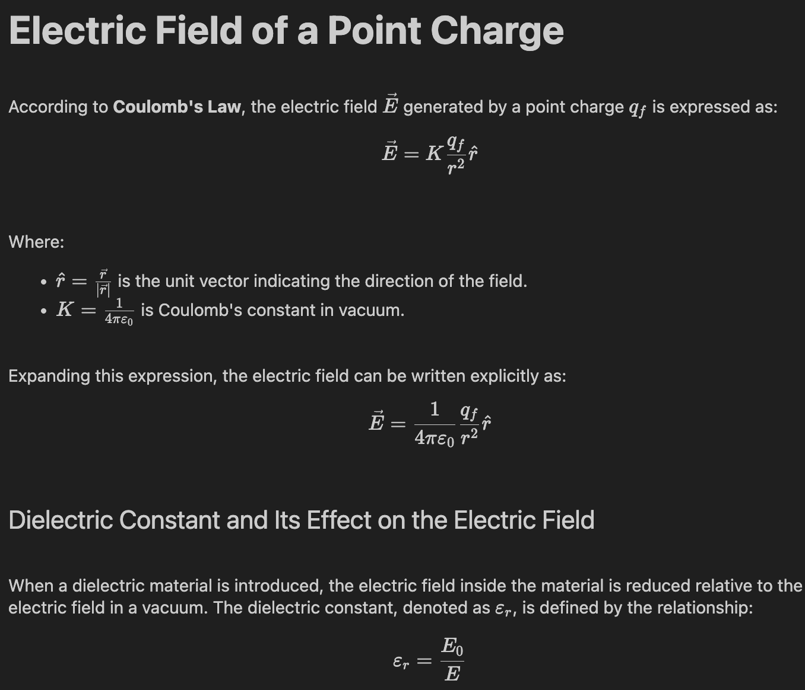

# Electric Field Visualization

This project simulates and visualizes the electric field generated by one or more point charges. It was developed as part of a university lab course on Fluid Mechanics and Thermal Phenomena.

The simulation uses vector field plots and electric field lines to provide a clear understanding of electrostatic interactions.

## Example Output

<h4>Electric Field of a point charge in a vaccum</h4>
<br>
<p align="center">
  
  
</p>

<br>

<table>
    <tr>
        <th><h4>Diaelectric constants</h4></th>
        <th><h4>Paper</h4></th>
    </tr>
    <tr>
    <td></td>
    <td></td> 
  </tr>
  <tr>
    <th><h4>Silicone Oil</h4></th>
    <th><h4>Water</h4></th>
  </tr>
  <tr>
    <td></td>
    <td></td>
  </tr>
  
  
</table>

## Features

- Simulation of electric fields from multiple point charges.
- Vector field plotting using `quiver`.
- Field line tracing using `streamplot`.
- Interactive adjustment of charge positions and magnitudes.

## Technologies

- Python 3
- NumPy
- Matplotlib
- Jupyter Notebook

## Installation

1. Clone the repository:
   ```bash
   git clone https://github.com/tu-usuario/electric-field-visualization.git
   cd electric-field-visualization
   ```

2. Create a virtual environment (optional but recommended):
   ```bash
   python -m venv venv
   source venv/bin/activate  # On Windows: venv\Scripts\activate
   ```

3. Install dependencies:
   ```bash
   pip install -r requirements.txt
   ```

4. Launch Jupyter Notebook:
   ```bash
   jupyter notebook
   ```

## File Structure

```
electric-field-visualization/
│
├── Visualización_de_un_Campo_Eléctrico.ipynb
├── README.md
├── requirements.txt
└── images/
    └── example_field.png
```

## License

MIT License. Feel free to use or modify this project with attribution.

## Authors
Ana Laura Chenoweth Galaz
Denisse Antunez Lopez
Georgina Salcido Valenzuela
